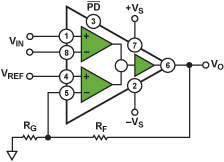
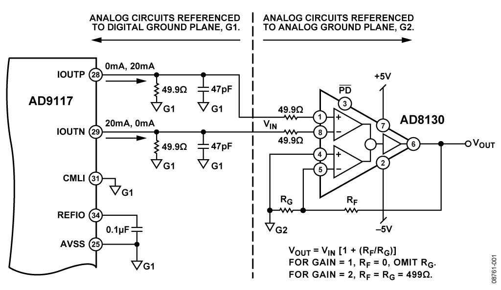

# 第一章、制作元器件

[TOC]

其实，最好的建议是熟悉`kicad`中元器件编辑器`Schematic Library Editor`的使用方法，阅读手册。下面只是我提取的，制作自己元器件的几个方法。

kicad中元器件的管理思路是

 - 很多已有的元器件，放置在`Preference`下一级`Component Libraries`下，通过修改添加，可以增添自己的元件库
 - 在元器件编辑器中，有两个概念，其一是当前库`Current Library`，隐含的另外概念就是其他库啦
 - 任何元器件的选择、编辑、属性修改都要在当前库下进行

元器件库的编辑无非有三个内容

 - 已有的元器件，我们知道它在哪个库里面
 - 管脚类似的元器件，我们只需简单修改
 - 未知的元器件，我们需要重新设计
 - 其他的一些小技巧：批量制作、大规模多引脚元器件制作方法等

掌握了以上思路，对于元器件的管理就很好理解啦。

## 1.1 将已有元器件添加到我们自己的库中

关键：现有元件库必须在元器件库的搜索目录中。

只需做以下三步：
 1. 选择当前库，例如`devices`
 2. 选择库中的元器件，例如电阻`R`
 3. 将其另存到新的元器件库中，图标注释为`Save Current Component to new library`

注意，这样也是制作**新的元件库**的一个方法哦。

## 1.2 修改现有元器件

只需做以下四步：
 1. 选择当前库，例如`devices`
 2. 选择库中的元器件，例如电阻`R`
 3. 基于这个元器件生成新的元器件，图标为`Create a new component from the current one`
 4. 保存到我们自己的元器件库即可

## 1.3 新制作一个元器件（重点）

关键：阅读元器件的使用手册、参考电路等，设计规范的元器件。

（初始化）只需做以下2步：
 1. 选择我们的元器件库为当前元件库，例如`my.lib`
 2. 选择新建元器件，图标为`Create a new component`

随后就是编辑元器件了。例如，我们想制作一个`AD8130`，它大概长这个样子。

我们既可以按照原理图进行设计，也可以按照封装设计，不过后者的美观性就差很多了（但是便于与实物对应）

在Analog的官方网页中，参考电路是这样设计的

当然根据对于管脚的理解，将`FB`放在右边也是可以的，参见俄罗斯网友的设计

好了，讲了这么多，就是强调阅读手册和google搜索的重要性。

我们选择官方`an1214`的参考电路进行设计。

## 1.4 元器件制作技巧集锦

### 1.4.1 一个器件包含多个opamp时怎么制作元器件呢？