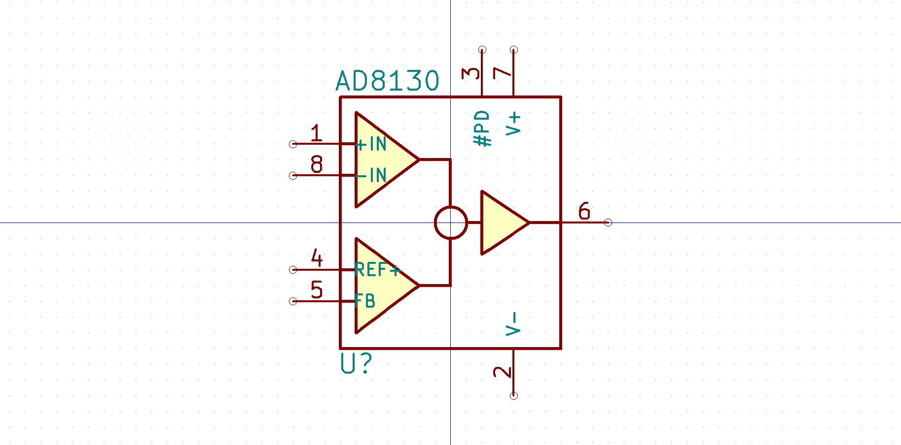

# 第一章、制作元器件

其实，最好的建议是熟悉`kicad`中元器件编辑器`Schematic Library Editor`的使用方法，阅读手册。下面只是我提取的，制作自己元器件的几个方法。

kicad中元器件的管理思路是：

 - 已有的元件库放置在`Preference`下一级`Component Libraries`下，通过修改或添加路径，可以增添自己的元件库
 - 在元器件编辑器中，有一个重要的概念是**当前库**`Current Library`
 - 任何元器件的选择、编辑、属性修改都要在**当前库**下进行；而选取元器件，首先需要切换到该元器件所在的库，随后才能在这一基础上操作。

这样，元器件库的增、删、编辑无非有以下几个类型：

 - 已有的元器件，我们知道它在哪个库里面
 - 管脚类似的元器件，我们只需简单修改
 - 未知的元器件，我们需要重新设计
 - 其他的一些小技巧：批量制作、大规模多引脚元器件制作方法等

掌握了以上思路，对于元器件的管理和编辑就很好理解啦。

**总结**：一句话，选取元器件库，1、增添新的，2、选取元器件，进行移动、修改。

## 1.1 将已有元器件添加到我们自己的库中

关键：现有元件库必须在元器件库的搜索目录中。

只需做以下三步：

 1. 选择当前库，例如`devices`
 2. 选择库中的元器件，例如电阻`R`
 3. 将其另存到新的元器件库中，图标注释为`Save Current Component to new library`

注意，这样也是制作、生成一个**新的元件库**的方法哦。我们假设新生成的库叫做`my.lib`

## 1.2 修改现有元器件

只需依次：

 1. 选择**当前库**，例如`devices`
 2. 选择库中的元器件，例如电阻`R`
 3. 切换**当前库**，例如我们自己的`my`
 3. 基于这个元器件生成新的元器件，图标为`Create a new component from the current one`
 4. 设计名字，进行编辑（例如添加引脚、外观等），保存我们自己的元器件库即可

**注意**：右键，选择特定的操作；或者记住**快捷键**，使用很方便。例如，`m`是移动，`e`是编辑，`g`是拖拉等，而键盘上的`insert`按键，即可重复上一个操作，类似于vim中的`.`操作。

 - 练习：修改linear中的`LM2903`，将其更名，添加到`my.lib`中。

## 1.3 新制作一个元器件（重点）

**关键：**阅读元器件的使用手册、参考电路等，设计规范的元器件。除此以外，就是用好管脚属性`Pin Properties`以及元器件属性`Component Properties`对话框。每一个绘制元素，从管脚到元器件的框图、文字等，都有属性，使用快捷键`E`可以编辑。

（初始化）只需做以下2步：
 1. 选择我们的元器件库为当前元件库，例如`my.lib`
 2. 选择新建元器件，图标为`Create a new component`

随后就是编辑元器件了。例如，我们想制作一个`AD8130`，它大概长这个样子。

我们既可以按照原理图进行设计，也可以按照封装设计，不过后者的美观性就差很多了（但是便于与实物对应）

在Analog的官方网页中，参考电路是这样设计的

当然根据对于管脚的理解，将`FB`放在右边也是可以的，参见德国网友的设计

好了，讲了这么多，就是强调**阅读手册**和**google搜索**的重要性。事实上，设计管脚、器件是一件因人而异的事情，但较好的设计能够帮助我们在后续原理图的绘制中更加得心应手。

我们选择官方`an1214`的参考电路进行设计，只不过我们绘制的是个方形的。最终做出来是这样子的：

**心得**：绘制`KiCaD`的元器件图，需要将管脚放在网格的整数倍位置上，如果器件的外观没法保证是规则的，或者管脚的`pin`没有完全位于整数网格的位置，没有关系，不要太在意。**电路设计的核心是原理图所体现的思想。**

## 1.4 元器件制作技巧集锦

**小结：**通过前面三个内容我们分别学习了如何添加、修改现有器件，新增自己的元器件。下面的一些小技巧，在后续的实际项目需求中慢慢总结吧。

### 1.4.1 一个器件包含多个opamp时怎么制作元器件呢？

可以在元器件的属性处，修改`part`的数目。这里面的要点是：有些管脚是多个part共用的，要在`pin`的属性中指明。CE视频中还指出，管脚或元器件的属性中，有一个锁定选项，但是我还没有学到那一步。

### 1.4.2 自动生成大批量管脚的元器件

在我们设计`microzed`的载板时，可能会用到。
