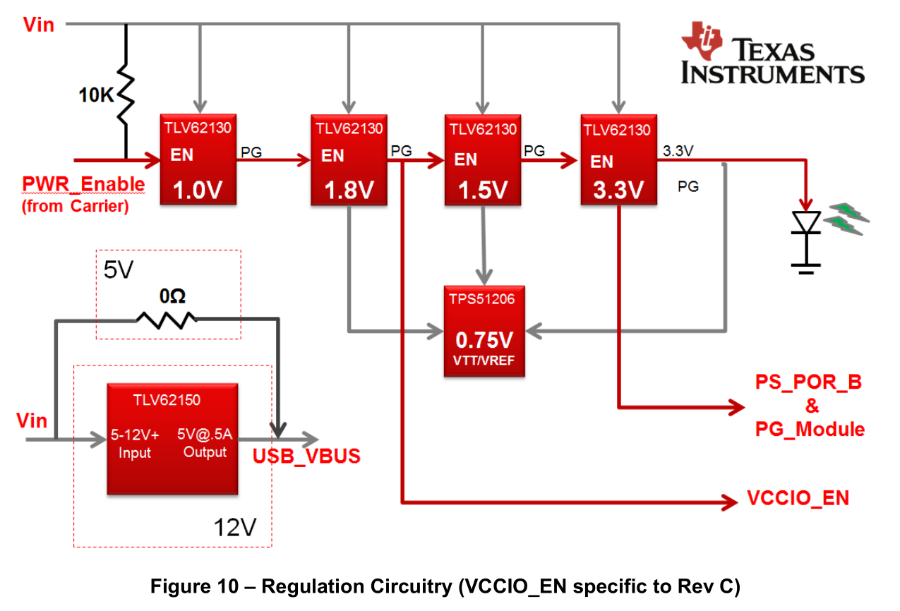
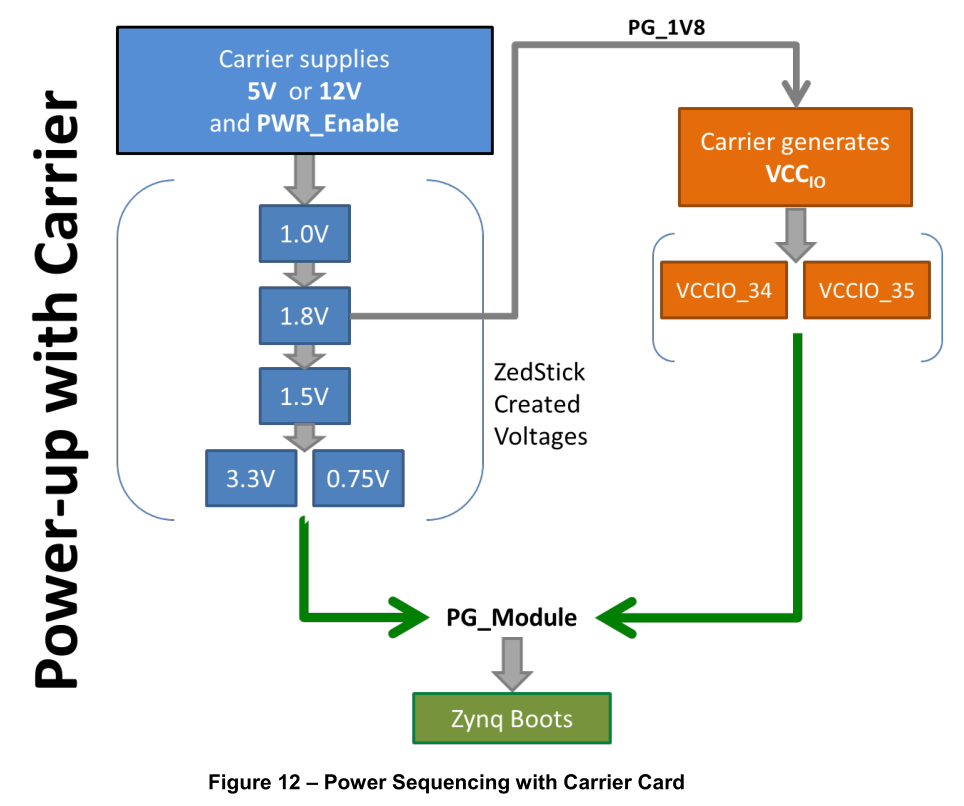

# Microzed的供电及载板设计要求

最近研究了一下Microzed的供电，以及载板的设计要求，包括`PG`，`PWR_EN`, `VCCIO_EN`等。在这里记录一下。

## 1. Microzed的上电顺序

Microzed由5V供电，7010耗电按照1.2A设计，7020按照1.4A设计。如果外部额外的供电是12V，需要降压（Buck）到5V即可，推荐美信、凌特、TI的芯片。Microzed首先启动的是内核电压1.0V，随后1.8V，随后1.5V，最后是3.3V。在独立模式下，如果3.3V上电完毕，板载Power Good灯会亮。这里需要注意的是：为了让Microzed启动，需要输入一个`PWR_Enable`脉冲，而Microzed的`PG_1V8`就是接口的`VCCIO_EN`，`PG_3V3`就是`PG_MODULE`。

因此在Microzed上，需要选择可级联的电源模块，也就是说电源模块PG的输出是与EN相关的。这里需要点名批评的是凌特的LT8610以及LT8614模块，这两个模块如果输入电压VIN在3.4V以上，则PG输出有效，这样的话就没法形成级联的启动顺序。

PG的输出一般都是增强型NMOSFET的Drain端口，因此需要外接上拉电阻。Drain端口的好处是多个PG可以直接连接，只有当所有PG都有效时，最终的输出值才是高电平。

## 2. PWR Enable的信号设置

参考Microzed FMC载板的设计，`PWR_Enable`由第一级5V输出确定，当5V为高时有效，当12V输入关断时拉低。在设计手册中，要求`PWR_EN`为 open drain 设计。这样，即便在Microzed在独立模式下，信号浮空拉高。

## 3. VCCIO Enable的信号使用

参考Microzed FMC载板的设计，`VCCIO_EN`用作触发`3V3_EN`，启动VCCIO电压的级联配置。顺序为，首先启动板载3V3，随后启动板载VADJ的供电，给Microzed的扩展管脚供电。最后当VADJ有效时，拉高`PG_CARRIER`。

事实上`VCCIO_EN`或者`PG_1V8`的含义是，VCCINT以及VCCAUX已经启动完毕，现在可以对VCCO进行供电了，用这个信号作为VADJ电源模块的EN管脚即可。

## 4. 上电复位

在Microzed的standalone模式中，板载复位由`PG_Module`确定。由于加入载板，POR则为`PG_Module`和`PG_Carrier`的或，只有当两者同时有效时，POR才会拉低停止复位。

## 5. 完整启动顺序

最终启动顺序可以用下图来表示

在最下面的`PG_Module`是两组电同时有效的标志，最终会释放Zynq复位（PS，PL）状态，开始加载程序。
