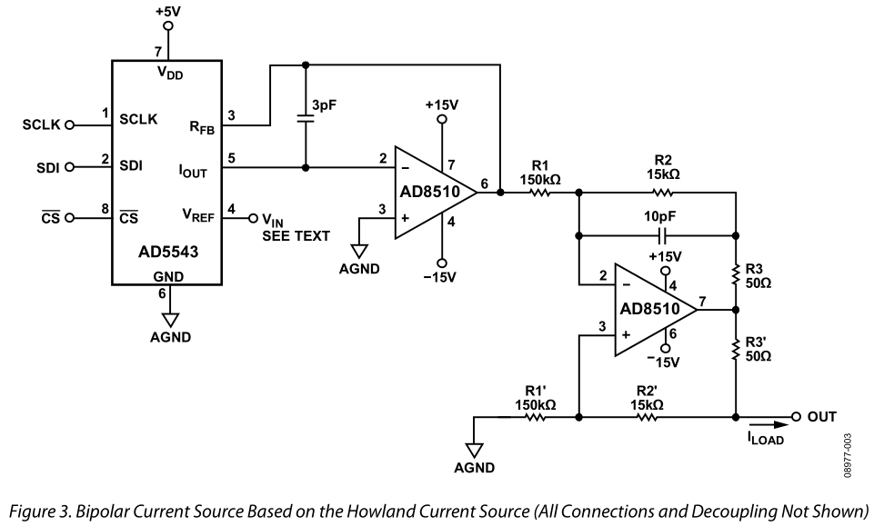
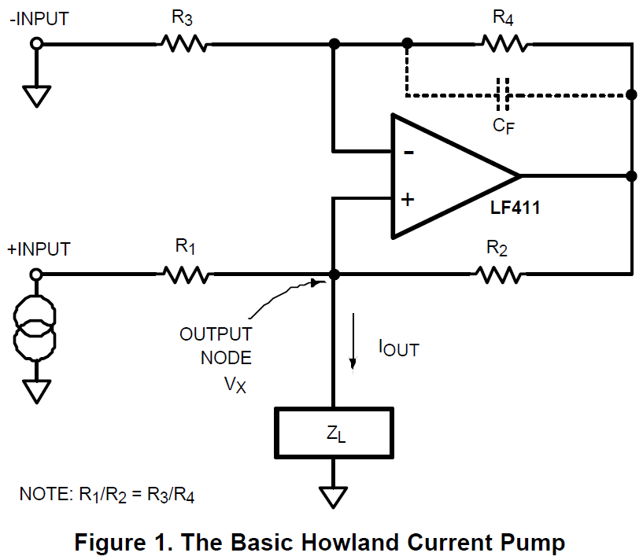
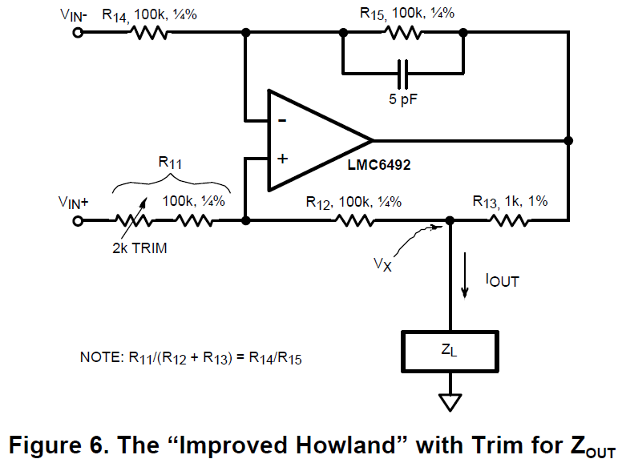
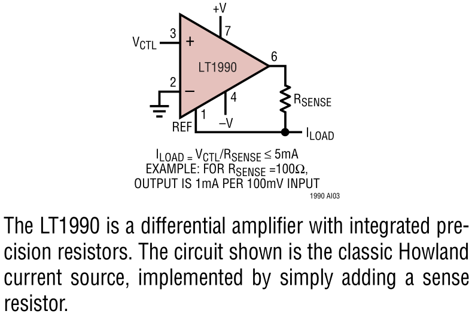

# VCCS and Current Sense Circuit

电流感知电路在一定程度上与恒流源是类似的：设计目的都是维持恒定的电流监测（sense）或激励（output）能力。

## 文献的研究成果

简单总结一下文献中的研究要点（Improved/Enhanced Howland Source）

 - Wang Yinan 研究了增强型Howland电流源，并研究了双运放的设计方法。器件：单运放使用`OPA843`，双运放使用`OPA843`与`OPA653`。其中`OPA653`只是用于GIC（General Impedance Converter）。
 - Tucker 等人研究了改进型Howland电流源，并提出在运放输入端短接RC补偿电路（Lead-Lag），初步估计在这一简单的电流源上，可以实现1MHz的3dB带宽。

## Howland电流源设计要点（AN-1515/TI）

主要阅读TI的文档`AN-1515.pdf`，以及AD的文档`CN-0151.pdf`，Apex的文档`AN13.pdf`。

### 1、CN0151

先看`CN-0151`中的参考电路。我们直接看Howland的图

若选择差分互补型电流输出DAC，则还可以用AD8130做输出缓冲。输出电流为（假设电阻完全匹配）：

公式中`R3`需要远远小于`R1`或者`R2`，D是DAC的输出比例（fractional words）。Howland电流源对电阻匹配和电阻精度要求较高，一般需要达到0.1%的数量级，并且最好使用**高精度、一致性高的排阻**。

文章中还提到，Howland型输出相对于MOSFET输出的优缺点在于

 - 高输出阻抗（可能相对于在低频段有高输出阻抗）
 - 提供双极性输出（Bipolar output current）
 - 但是，要求Howland电路的电阻匹配，可以用排阻，对PCB板设计的要求较高

### 2、Apex AN-13

Apex的文档指出，反馈支路的电阻需要调节匹配以便实现最佳的电流源

> The circuit of Figure 8 actually required a slight amount of mismatch in the two
> (RF) resistors to compensate for mismatches elsewhere,
> suggesting that the inclusion of a trimpot may be necessary
> to obtain maximum performance.

### 3、TI AN-1515

最后，我们通过文档`AN-1515.pdf`来研究Howland电路的设计要点。这篇文献需要重点阅读。

基本Howland电流源：

重点放在改进型Howland电路：

若匹配做的不好，还有可能出现负输出阻抗的情况。四个电阻可以用排阻，并使用`R13`和`R13'`高精密电阻进行匹配。

## 利用AD8130设计电流源电路

### 1、原理

基本原理可见Linear的文档：`AN-105: Current Sense Circuit Collection`

### 2、ac coupling circuit

就是交流耦合输出。AD8130电流源的本质就是上图，自行分析。

> the AD8130's relatively high input bias current can affect output-current accuracy at low current levels.

 - 使用单位增益反馈放大器隔离输出和输入
 - 使用交流耦合输出的电路，可以使用`dc servo loop`来稳定（stabilize）电路的`operating point`。也就是创建直流流出电路（若都用AC耦合，则直流无法流出）

### 3、dc stabilization circuit

DC工作点稳定电路，其功能就是在AC耦合输出或者没有DC流出支路的情况下，创建反馈电路，保证放大器稳定工作。另外一种说法是为了在较小电流输出时能有精确的控制能力。

发现大学期间学习的Laplace变换用于电路分析还是很有用的嘛。

### 4、补偿电路

在Tucker等人的文献中，也叫作`lead lag`补偿电路。在标准设计中，仅包含一个3到20pF的补偿电容`Ccomp`，用以补偿杂散电容的影响。

## 绘制原理图

我们在AD8130的基础上制作两个原理图，其一是单运放的，其二是双运放加入`dc servo loop`的电路。分别参考kaufmann的论文和Alex Birkett的文章。最终PCB制作成载板的形式。
